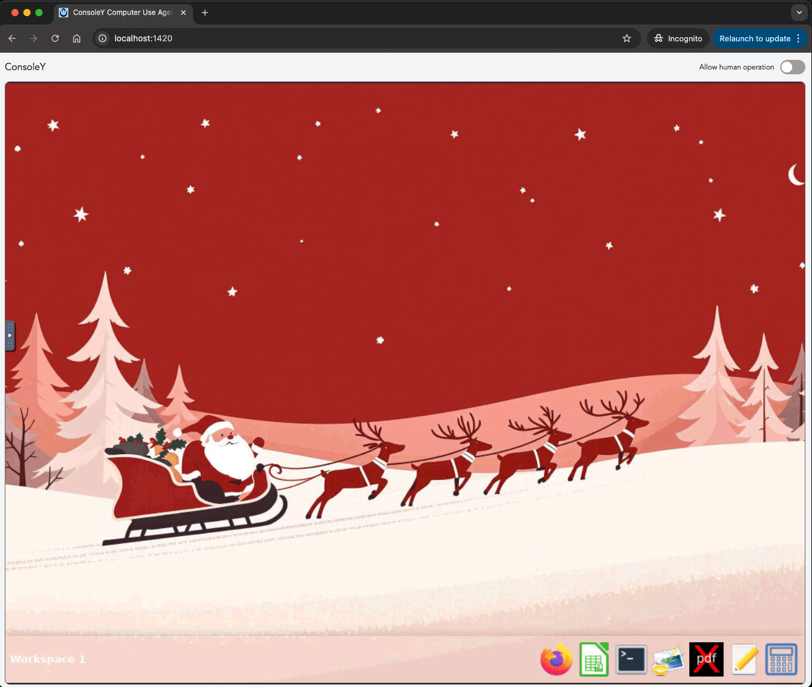

# ConsoleY
Computer Use Desktop & API

```
 ______   ______   __   __   ______   ______   __       ______   __  __   
/\  ___\ /\  __ \ /\ "-.\ \ /\  ___\ /\  __ \ /\ \     /\  ___\ /\ \_\ \  
\ \ \____\ \ \/\ \\ \ \-.  \\ \___  \\ \ \/\ \\ \ \____\ \  __\ \ \____ \ 
 \ \_____\\ \_____\\ \_\\"\_\\/\_____\\ \_____\\ \_____\\ \_____\\/\_____\
  \/_____/ \/_____/ \/_/ \/_/ \/_____/ \/_____/ \/_____/ \/_____/ \/_____/
```

Anthropic 的 Computer use 功能，让用户可以通过工具调用操作计算机，成为用户计算机操作的超级代理。不过，官方提供的demo中聊天界面和桌面是集成在一起的，不能分开使用，也不能远程通过API调用。

ConsoleY 是一个基于 Docker 的远程桌面环境，它将 Ubuntu 桌面环境容器化，不仅可以通过浏览器访问，还通过 Rust 实现的 API 服务提供远程控制能力，从而可以与任何支持工具调用的本地或云端AI助手配合使用。



## 功能特点

- 🖥️ 基于Docker的 Ubuntu 桌面环境，可通过浏览器访问
- 🚀 基于 Rust 提供完整的计算机操作 API 服务，包括桌面操作、文件操作、Shell 命令执行等，支持热加载。

## 快速开始

### 环境要求
- Docker
- Docker Desktop
- Docker Compose

### 构建和运行

```bash
# 克隆仓库
git clone git@github.com:consoley/consoley.git
cd consoley

# 构建开发环境镜像
docker-compose build

# 启动开发环境容器
docker-compose up -d
```

当容器启动后，API 服务会自动启动，可以通过 `http://localhost:8090` 访问 API 服务。健康状态可以通过 `http://localhost:8090/health` 访问。

原始桌面GUI可以通过 `http://localhost:6070` 访问。

```bash
# 停止开发环境容器
docker-compose down
```

### 打开可控制的桌面

```bash
# 安装前端依赖
npm install

# 启动桌面
npm run dev
```
运行后可以通过浏览器访问 `http://localhost:1420` 打开桌面。

## API 接口访问

Docker 容器启动后，API 服务会自动启动，可以通过 `http://localhost:8090` 访问 API 服务。

API 接口的设计参照Anthropic的Computer use功能，支持桌面操作、文件操作、Shell 单个端点。详情请参照[API 接口文档](api.md)。

## 许可证

[MIT License](LICENSE)
